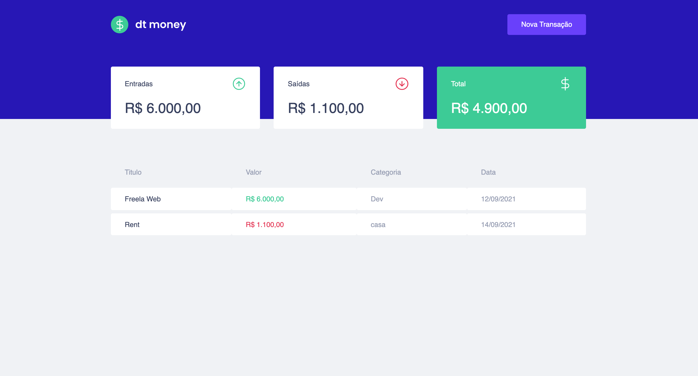

# DT-MONEY 



### Aplicação desenvolvida no decorrer do 2º capítulo do curso Ignite. 

### Neste projeto foram utilizados as seguintes tecnologias:

* [React](https://reactjs.org/)
* [TypeScript](https://www.typescriptlang.org/)
* [Styled Components](https://styled-components.com/)
* [MirageJS](https://miragejs.com/)
* [Axios](https://github.com/axios/axios)
* [Polished](https://polished.js.org/)

<br>

```bash
# Abra um terminal e copie este repositório com o comando
git clone https://github.com/JhonatanClarindo/dt-money.git
# ou use a opção de download.
# Entre na pasta web com 
cd dtmoney
# Instale as dependências
yarn install
# Rode a aplicação
yarn start
```


